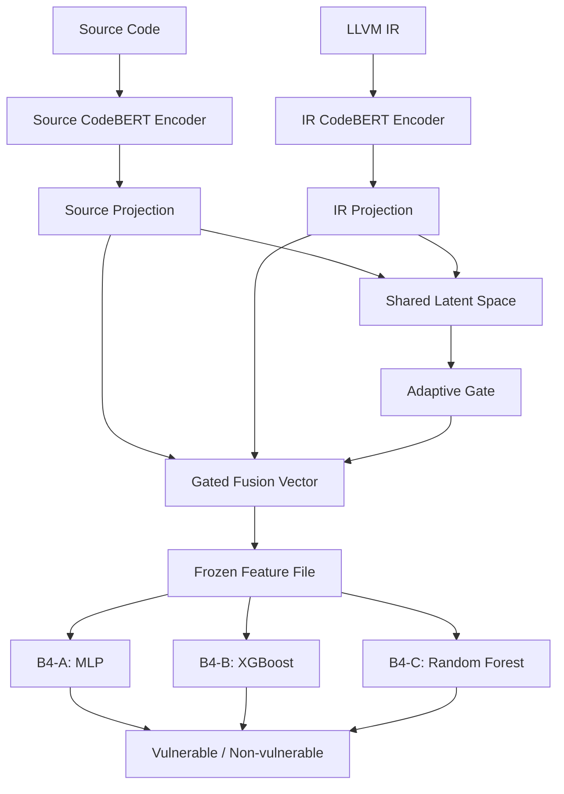

# B4 Classifier Ablations

This folder adds classifier-only ablations for the existing B4 model without changing the main project code.

The existing B4 pipeline remains:

```text
Source code + LLVM IR
-> CodeBERT encoders
-> shared latent projection space
-> adaptive gated fusion
-> linear binary classifier
```

These ablations keep the trained B4 encoders, shared latent space, and adaptive gated fusion frozen. Only the final classifier is changed.

## Variants

- `B4-A`: adaptive gated fusion + MLP classifier
- `B4-B`: adaptive gated fusion + XGBoost classifier
- `B4-C`: adaptive gated fusion + Random Forest classifier

## Flow



## Install Ablation Dependencies

The main `requirements.txt` is not changed. Install the extra ablation dependency only when you want to run XGBoost:

```powershell
pip install -r ablation/requirements-ablation.txt
```

`B4-A` and `B4-C` use packages already present in the main project, except for `joblib`, which is included here for saving/loading sklearn models.

## Step 1: Extract Frozen B4 Features

Train B4 first using the existing project flow so that `b4_best.pt` exists in `paths.checkpoints`.

Then run:

```powershell
python ablation/extract_b4_features.py --config configs/500_samples.yaml
```

This creates:

```text
ablation/features/train.npz
ablation/features/validation.npz
ablation/features/test.npz
```

Each file contains:

- `sample_ids`
- `labels`
- `fused`
- `alpha_mean`

## Step 2: Train Ablation Classifiers

Train one variant:

```powershell
python ablation/train_ablation.py --config configs/500_samples.yaml --variant b4-a
python ablation/train_ablation.py --config configs/500_samples.yaml --variant b4-b
python ablation/train_ablation.py --config configs/500_samples.yaml --variant b4-c
```

Or train all:

```powershell
python ablation/train_ablation.py --config configs/500_samples.yaml --variant all
```

Model files are saved to:

```text
ablation/models/b4-a_mlp.pt
ablation/models/b4-b_xgboost.joblib
ablation/models/b4-c_random_forest.joblib
```

## Step 3: Evaluate Ablation Classifiers

Evaluate one variant:

```powershell
python ablation/evaluate_ablation.py --config configs/500_samples.yaml --variant b4-a
```

Or evaluate all:

```powershell
python ablation/evaluate_ablation.py --config configs/500_samples.yaml --variant all
```

Results are saved to:

```text
ablation/results/b4-a_metrics.json
ablation/results/b4-a_predictions.csv
```

The same naming pattern is used for `b4-b` and `b4-c`.

## Metrics

Evaluation writes:

- accuracy
- precision
- recall
- F1
- ROC-AUC
- false positive rate
- threshold

The default threshold comes from `training.threshold` in the config.
